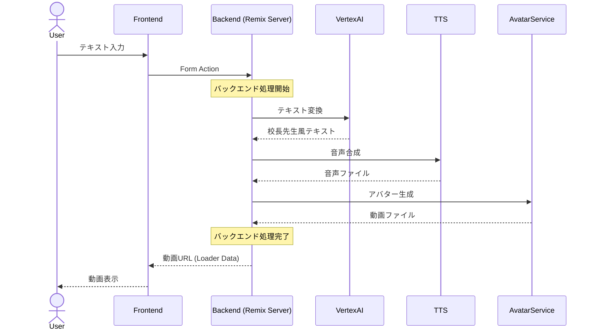

# AIコウチョウ - 基本設計書

## 1. システム概要

### 1-1. 目的

ユーザーが入力したテキストを校長先生風のスピーチに変換し、音声付きアバター動画として出力するサービス。

### 1-2. 基本フロー



## 2. 機能要件

### 2-1. 必須機能

- テキスト入力フォーム
- 入力サポートAI機能
  - キーワード展開
  - テーマ別アシスト
  - 文章編集支援
- 校長先生風テキスト変換
  - コンテンツ拡充（教育的要素の追加）
  - 文体変換（校長先生らしい表現）
  - 構造最適化（スピーチ構成）
- 音声合成
- アバター動画生成
- 動画プレビュー/ダウンロード

### 2-2. オプション機能

- 校長先生キャラクター選択
- BGM/効果音追加
- SNSシェア機能
- 字幕生成

## 3. 技術スタック

### 3-1. フロントエンド

- Framework: Remix
- UI: TailwindCSS
- State管理: Remix Loader/Action
- Form処理: Remix Form
- クライアントキャッシュ: Remix Browser Cache

### 3-2. バックエンド

- Runtime: Node.js
- Framework: Remix (Server Side)
- インフラ: Cloud Run
- ストレージ: Cloud Storage
- セッション: Redis

### 3-3. AI/外部サービス

- テキスト生成: Vertex AI (PaLM 2)
  - 入力サポート用プロンプト
  - 校長先生風変換用プロンプト
    - コンテンツ拡充プロンプト
    - 文体変換プロンプト
    - 構造最適化プロンプト
  - 文章編集・調整用プロンプト
- 音声合成: Cloud Text-to-Speech
- アバター生成: D-ID
  - リップシンク処理
  - 表情生成
  - 日本語対応

### 3-4. D-ID連携仕様

- エンドポイント: D-ID Talks API
- 認証方式: Basic認証 (APIキー)
- 入力パラメータ:
  - 音声ファイルURL
  - スクリプトテキスト
  - アバターID
- 非同期処理:
  - Webhook通知による生成完了検知
  - ステータス管理による進捗把握
- 校長先生アバター:
  - デフォルトアバターID: schoolPrincipal-jp-m01
  - 表情設定: 自然な会話表現
  - リップシンク: 日本語音声に最適化

## 4. データ設計

### 4-1. 生成リクエスト

- 入力パラメータ:
  - テキスト内容 (必須)
  - 入力サポート設定
    - キーワードリスト
    - テーマ指定
    - 展開方向性
  - 変換設定
    - 教育的要素の強さ (1-5)
    - 文体の格調レベル (1-5)
    - スピーチの長さ (短/中/長)
  - キャラクターID (任意)
  - BGM設定 (任意)
  - 字幕設定 (任意)

### 4-2. 生成結果

- 生成ID
- ステータス (処理中/完了/エラー)
- 動画URL (生成完了時)
- エラー情報 (エラー発生時)

## 5. ルート設計

### 5-1. アプリケーションルート

- メインページ (入力フォーム)
- 動画生成処理
- 生成状況確認
- 動画取得・表示

### 5-2. エラーハンドリング

- グローバルエラーハンドリング
- エラー表示UI
- エラーログ記録

## 6. 非機能要件

### 6-1. パフォーマンス

- 動画生成完了まで: 60秒以内 (D-IDの処理時間を考慮)
- 同時リクエスト処理: 100req/min
- 動画品質: 720p/30fps
- クライアントサイドキャッシュ活用
- D-ID API制限:
  - 同時生成数: 5件
  - 動画長: 最大5分

### 6-2. セキュリティ

- CSRF対策 (Remix Form)
- 入力テキストのサニタイズ
- 不適切コンテンツフィルタ
- 一時URLの有効期限設定

### 6-3. 可用性

- サービス稼働率: 99.9%
- バックアップ: 毎日
- 障害復旧: 2時間以内

## 7. 開発フロー

### 7-1. 開発環境

```bash
# プロジェクト作成
npx create-remix@latest

# 開発サーバー起動
npm run dev

# ビルド & デプロイ
npm run build
npm run deploy
```

### 7-2. 環境変数

```bash
# .env
SESSION_SECRET=xxx
VERTEX_AI_PROJECT_ID=xxx
CLOUD_TTS_KEY=xxx
D_ID_API_KEY=xxx
REDIS_URL=xxx

# development.env
DEBUG=true
STORAGE_BUCKET=xxx
```

## 8. 監視・運用

### 8-1. モニタリング項目

- API レスポンスタイム
- 動画生成成功率
- ストレージ使用量
- APIコスト

### 8-2. アラート条件

- エラー率 > 5%
- レスポンスタイム > 10秒
- ストレージ使用量 > 80%

## 9. 制限事項

### 9-1. 技術的制限

- 入力テキスト: 最大1000文字
- 生成動画時間: 最大5分 (D-ID制限に準拠)
- ファイル保持期間: 24時間
- アバター制限:
  - 使用可能アバター: D-ID提供の標準アバターのみ
  - カスタムアバター: 別途契約が必要

### 9-2. 運用制限

- 1ユーザーあたりの生成回数: 10回/日
- 同時生成数: 3件まで
- ストレージ容量: 1GB/ユーザー
