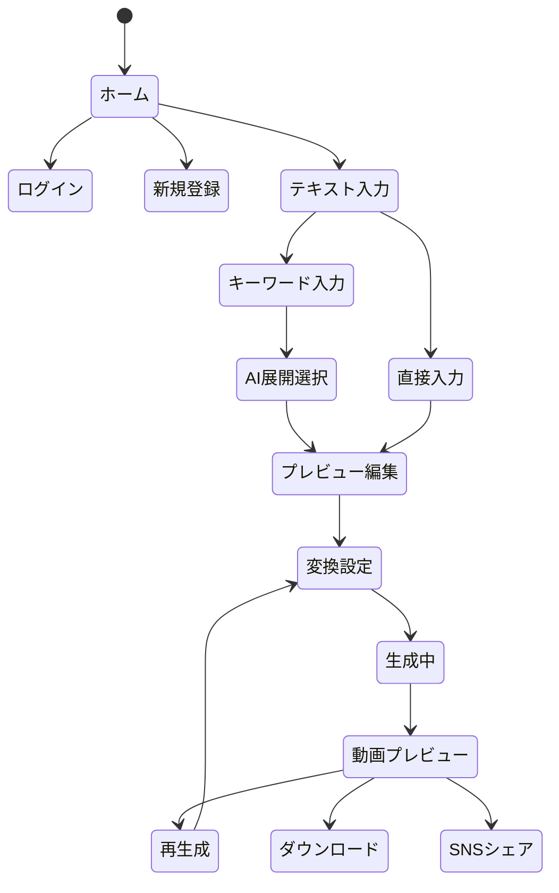

# AIコウチョウ - UI/UX設計書

## 0. 機能優先度分類

### 0-1. MVP（必須機能）

- テキスト入力と基本的な変換
  - 直接テキスト入力
  - 校長先生風への変換
  - 基本的な音声・動画生成
- シンプルな設定
  - 声質選択（男性/女性）
  - スピーチの長さ調整
- 基本的なプレビューと共有
  - 動画プレビュー
  - ダウンロード機能
- 最小限のエラーハンドリング
  - 基本的なエラー表示
  - 入力バリデーション

### 0-2. 基本機能（第2フェーズ）

- 拡張入力サポート
  - キーワード入力モード
  - AI展開案の提示
  - テンプレート機能
- 詳細設定
  - 教育的要素の強さ調整
  - 文体の格調レベル調整
  - BGM選択
- プレビューと編集
  - テキストの部分編集
  - リアルタイムプレビュー
  - 変更履歴
- SNS連携
  - 主要SNSへの共有機能
  - 埋め込みコード生成

### 0-3. 追加機能（将来拡張）

- 高度なカスタマイズ
  - プリセット管理
  - テーマカスタマイズ
  - ショートカットキー設定
- アクセシビリティ
  - スクリーンリーダー対応
  - キーボード操作
  - 音声入力
- データ管理
  - 生成履歴
  - クラウドバックアップ
  - デバイス間同期
- コミュニティ機能
  - フィードバック収集
  - テンプレート共有
  - ランキング機能
- パフォーマンス最適化
  - PWA対応
  - オフラインモード
  - プログレッシブローディング

## 1. 画面遷移図



## 2. 画面ワイヤーフレーム

### 2-1. ホーム画面

```
+----------------------------------+
|  Logo                    Login   |
|----------------------------------+
| ようこそ、AIコウチョウへ        |
|----------------------------------+
| [入力開始]                       |
|----------------------------------+
| 人気の生成例                     |
| +----------+  +----------+       |
| |サムネイル|  |サムネイル|      |
| |          |  |          |      |
| +----------+  +----------+      |
|----------------------------------+
| 使い方ガイド                     |
| 1. テキスト入力                  |
| 2. AI変換                        |
| 3. 動画生成                      |
+----------------------------------+
```

### 2-2. テキスト入力画面

```
+----------------------------------+
| < 戻る                           |
|----------------------------------+
| 入力方式を選択：                 |
| [キーワード入力] [直接入力]      |
|----------------------------------+
| キーワード入力の場合：           |
| +------------------------------+ |
| |キーワード1:                 | |
| |キーワード2:                 | |
| |キーワード3:                 | |
| +------------------------------+ |
|                                  |
| 直接入力の場合：                 |
| +------------------------------+ |
| |                              | |
| |                              | |
| |                              | |
| +------------------------------+ |
| 文字数: 0/1000                   |
|                                  |
| [次へ]                           |
+----------------------------------+
```

### 2-3. AI展開選択画面

```
+----------------------------------+
| < 戻る                           |
|----------------------------------+
| AIによる展開案：                 |
|                                  |
| 案1:                             |
| +------------------------------+ |
| |                              | |
| +------------------------------+ |
| [選択]                           |
|                                  |
| 案2:                             |
| +------------------------------+ |
| |                              | |
| +------------------------------+ |
| [選択]                           |
|                                  |
| 案3:                             |
| +------------------------------+ |
| |                              | |
| +------------------------------+ |
| [選択]                           |
|                                  |
| [さらに案を生成]                 |
+----------------------------------+
```

### 2-4. プレビュー編集画面

```
+----------------------------------+
| < 戻る                           |
|----------------------------------+
| テキストプレビュー：             |
| +------------------------------+ |
| |                              | |
| |                              | |
| +------------------------------+ |
|                                  |
| 編集オプション：                 |
| [一部を再生成] [長さ調整]        |
| [キーワード追加]                 |
|                                  |
| 変換後イメージ：                 |
| +------------------------------+ |
| |                              | |
| |                              | |
| +------------------------------+ |
|                                  |
| [次へ]                           |
+----------------------------------+
```

### 2-5. 変換設定画面

```
+----------------------------------+
| < 戻る                           |
|----------------------------------+
| 変換設定：                       |
|                                  |
| 教育的要素の強さ                 |
| [1] [2] [3] [4] [5]             |
|                                  |
| 文体の格調レベル                 |
| [1] [2] [3] [4] [5]             |
|                                  |
| スピーチの長さ                   |
| [短] [中] [長]                   |
|                                  |
| 声質選択                         |
| [男性1] [男性2] [女性]           |
|                                  |
| BGM                              |
| [なし] [厳か] [明るい] [感動的]  |
|                                  |
| [生成開始]                       |
+----------------------------------+
```

### 2-6. 生成中画面

```
+----------------------------------+
|                                  |
|           生成中...              |
|                                  |
| [==========] 80%                 |
|                                  |
| 現在の処理：                     |
| 1. ✓ テキスト変換               |
| 2. ✓ 音声合成                   |
| 3. → アバター生成中...          |
| 4. 動画作成                      |
|                                  |
| 推定残り時間: 30秒               |
+----------------------------------+
```

### 2-7. 動画プレビュー画面

```
+----------------------------------+
| < 戻る                           |
|----------------------------------+
| プレビュー                       |
| +------------------------------+ |
| |                              | |
| |         動画表示             | |
| |                              | |
| +------------------------------+ |
| [▶ 再生] [■ 停止]              |
|                                  |
| 操作メニュー：                   |
| [ダウンロード] [再生成]          |
|                                  |
| SNSシェア：                      |
| [Twitter] [Instagram] [YouTube]   |
+----------------------------------+
```

## 3. インタラクション定義

### 3-1. テキスト入力

- キーワード入力
  - 3つまでのキーワードを入力可能
  - 各キーワードは30文字まで
  - 入力完了後、自動でAI展開案を生成

- 直接入力
  - 1000文字までのテキスト入力
  - リアルタイムの文字数カウント
  - 文字数超過時は赤文字で警告

### 3-2. AI展開選択

- 展開案の表示
  - 3つの異なる展開案を同時表示
  - 各案をクリックで詳細表示
  - プレビューモードで校長先生風の変換後イメージを確認可能

- 案の選択
  - 選択ボタンクリックで次画面へ
  - 「さらに案を生成」で新しい3案を生成
  - 気に入った案をベースに微調整可能

### 3-3. プレビュー編集

- テキスト編集
  - 直接編集可能な領域
  - 部分的な再生成機能
  - 変更履歴の保持（元に戻す機能）

- リアルタイムプレビュー
  - 編集内容に応じて変換後イメージを更新
  - 文体レベルのスライダー調整
  - キーワードのハイライト表示

### 3-4. 変換設定

- パラメータ調整
  - スライダーによる数値設定
  - プリセット選択機能
  - カスタム設定の保存機能

- プレビュー機能
  - 設定変更時の簡易プレビュー
  - 音声サンプルの試聴
  - アバターの表情プレビュー

### 3-5. 生成中

- 進捗表示
  - 全体の進捗バー
  - 各ステップの状態表示
  - 残り時間の表示

- バックグラウンド処理
  - 画面を離れても処理継続
  - プッシュ通知による完了通知
  - エラー時の自動リトライ

### 3-6. 動画プレビュー

- 動画操作
  - 通常の再生コントロール
  - シークバーでの位置調整
  - 音量調整

- シェア機能
  - ワンクリックSNSシェア
  - リンクのコピー
  - 埋め込みコード生成

## 4. エラー表示パターン

### 4-1. 入力エラー

```
+----------------------------------+
| ⚠ エラー                        |
|----------------------------------+
| 文字数が制限を超えています       |
| 現在: 1200文字 (上限: 1000文字)  |
|                                  |
| [修正する]                       |
+----------------------------------+
```

### 4-2. 通信エラー

```
+----------------------------------+
| ❌ 通信エラー                    |
|----------------------------------+
| サーバーとの通信に失敗しました   |
| しばらく待ってから再試行してくだ |
| さい                             |
|                                  |
| [再試行] [前の画面に戻る]        |
+----------------------------------+
```

### 4-3. 生成エラー

```
+----------------------------------+
| ⚠ 生成エラー                    |
|----------------------------------+
| 動画の生成に失敗しました         |
| エラーコード: E1234              |
|                                  |
| 考えられる原因：                 |
| ・不適切な内容が含まれている     |
| ・サーバーが混雑している         |
|                                  |
| [設定を変更] [最初からやり直す]  |
+----------------------------------+
```

### 4-4. 警告表示

```
+----------------------------------+
| ⚠ 注意                          |
|----------------------------------+
| 入力内容に不適切な表現が         |
| 含まれている可能性があります     |
|                                  |
| [修正する] [このまま続ける]      |
+----------------------------------+
```

### 4-5. 制限エラー

```
+----------------------------------+
| 🔒 利用制限                      |
|----------------------------------+
| 本日の生成回数上限に             |
| 達しました（10/10回）            |
|                                  |
| 制限は24時間後にリセットされます |
|                                  |
| [プレミアムプランへ] [閉じる]    |
+----------------------------------+
```

## 5. レスポンシブ対応

### 5-1. モバイル表示

- 画面幅に応じたレイアウト調整
- タッチ操作に最適化されたUI
- 縦長レイアウトでの表示最適化

### 5-2. タブレット表示

- 2カラムレイアウトの活用
- サイドバーメニューの実装
- タッチとマウス操作の両対応

### 5-3. デスクトップ表示

- ワイド画面での効率的な空間活用
- マルチペイン表示
- ショートカットキーの実装

## 6. アニメーションとトランジション

### 6-1. 画面遷移アニメーション

- ページ間のスライド遷移
- フェードイン/アウト効果
- 進捗状況の滑らかな更新

### 6-2. マイクロインタラクション

- ボタンのホバーエフェクト
- 入力フィールドのフォーカス効果
- スライダーの動的な値更新
- 校長先生アバターの表情変化プレビュー

### 6-3. 生成プロセスの視覚化

- テキスト変換時の文字アニメーション
- 音声波形の可視化
- アバター生成時のプログレッシブローディング

## 7. アクセシビリティ対応

### 7-1. 視覚的アクセシビリティ

- ハイコントラストモード
- 文字サイズ調整機能
- カラーユニバーサルデザイン
- スクリーンリーダー対応

### 7-2. 操作アクセシビリティ

- キーボード操作のサポート
- 音声入力オプション
- ジェスチャー操作の簡略化
- フォーカス順序の最適化

### 7-3. 補助機能

- 音声ガイダンス
- ツールチップとヘルプテキスト
- エラーメッセージの音声読み上げ
- 操作タイムアウトの延長オプション

## 8. パフォーマンス最適化

### 8-1. ローディング戦略

- スケルトンローディング
- プログレッシブ画像読み込み
- コンポーネントの遅延ローディング
- バックグラウンドデータのプリフェッチ

### 8-2. オフライン対応

- プログレッシブウェブアプリ（PWA）機能
- オフラインでの下書き保存
- 生成履歴のローカルストレージ
- 自動再開機能

## 9. ユーザーフィードバック機能

### 9-1. フィードバック収集

- 生成結果の評価（5段階）
- 改善提案の送信フォーム
- バグ報告機能
- 機能リクエスト

### 9-2. ヘルプとサポート

- チュートリアルモード
- コンテキストヘルプ
- よくある質問（FAQ）
- チャットサポート

## 10. カスタマイズと設定

### 10-1. ユーザー設定

- テーマカスタマイズ
- デフォルト値の保存
- ショートカットキーのカスタマイズ
- 通知設定

### 10-2. プリセット管理

- よく使う設定の保存
- プリセットの共有機能
- テンプレートの管理
- お気に入り機能

## 11. データ管理

### 11-1. 生成履歴

- 過去の生成履歴の表示
- 再生成機能
- 履歴の検索・フィルタリング
- エクスポート機能

### 11-2. バックアップと同期

- クラウドバックアップ
- デバイス間の設定同期
- 共有設定の管理
- データのインポート/エクスポート

## 12. セキュリティとプライバシー

### 12-1. データ保護

- 個人情報の暗号化
- セッション管理
- アクセス権限の設定
- データの自動削除

### 12-2. プライバシー設定

- 公開範囲の設定
- シェア設定の管理
- 追跡オプトアウト
- データ使用の透明性
