# AIコウチョウ - データフロー設計

## 1. シーケンス図

### 1-1. 正常系フロー

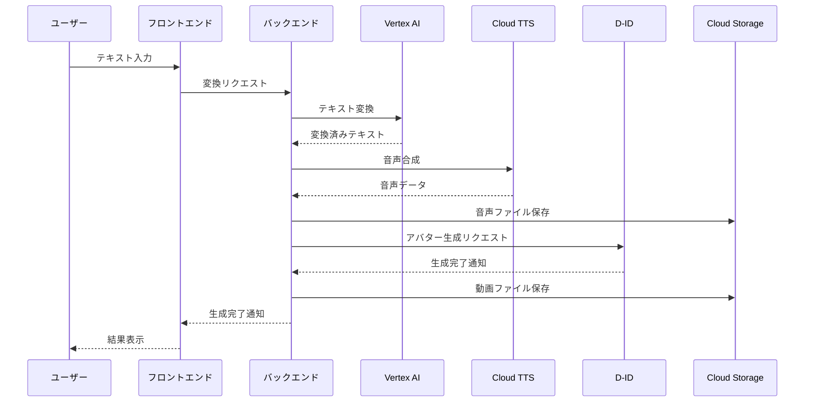

### 1-2. 非同期処理フロー

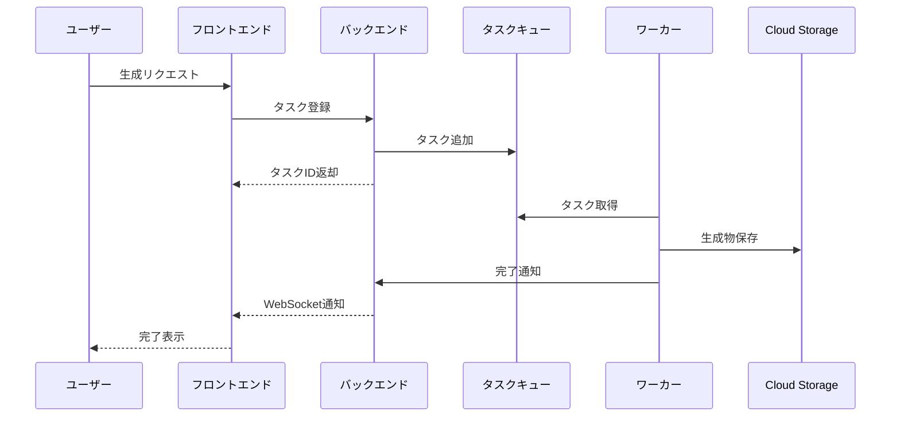

### 1-3. 進捗通知フロー

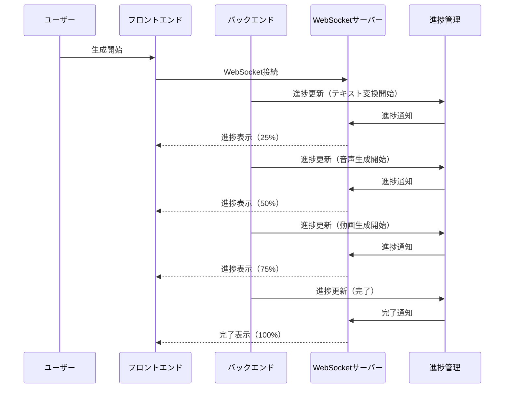

### 1-4. キャンセルフロー

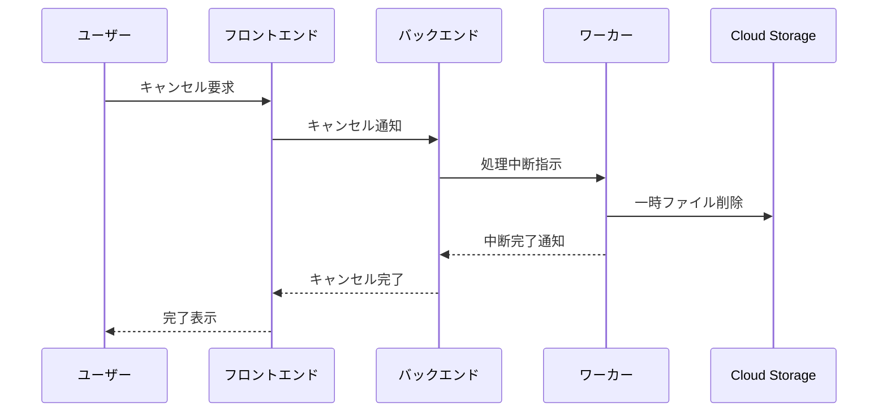

## 2. 状態遷移図

### 2-1. タスク状態遷移

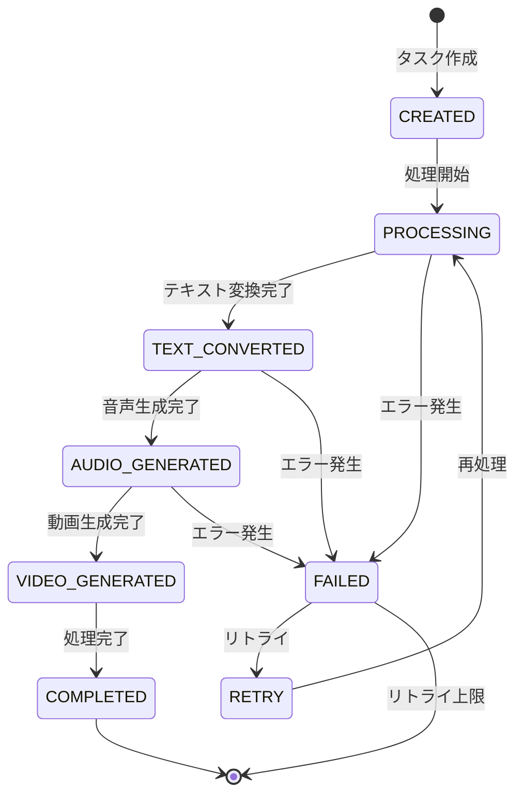

### 2-2. データライフサイクル

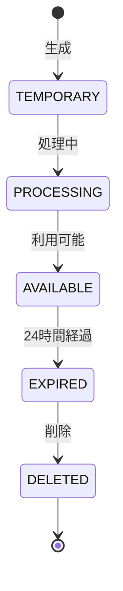

### 2-3. 進捗状態管理

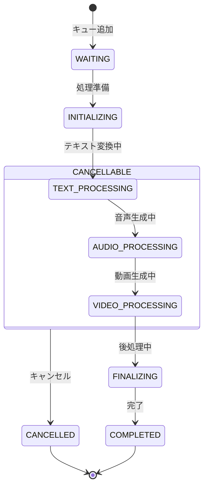

## 3. エラーフロー図

### 3-1. エラーハンドリングフロー

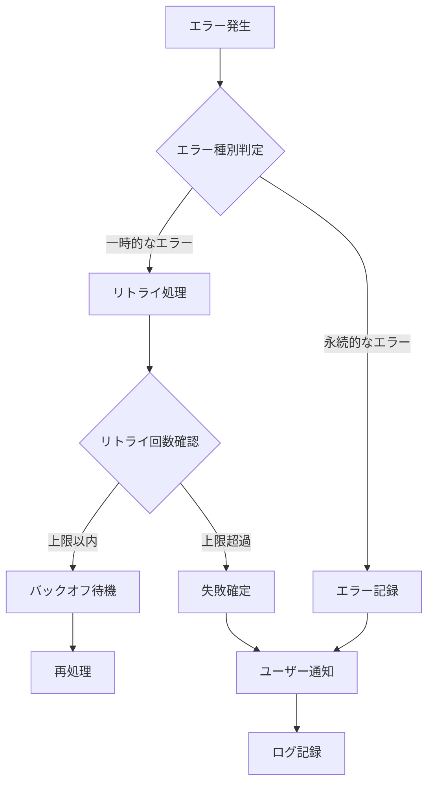

### 3-2. リカバリーフロー

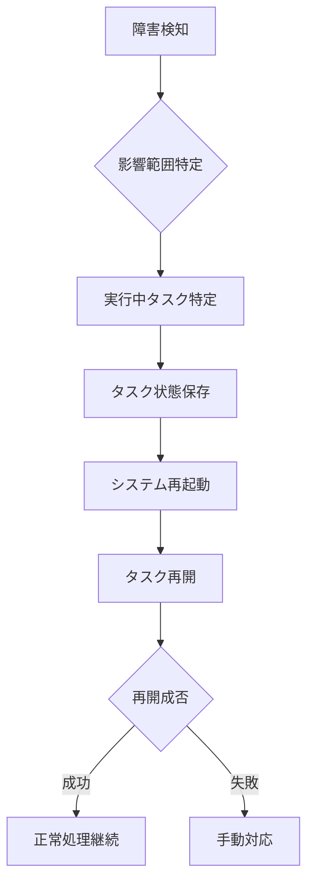

## 4. キャッシュ戦略

### 4-1. キャッシュ階層

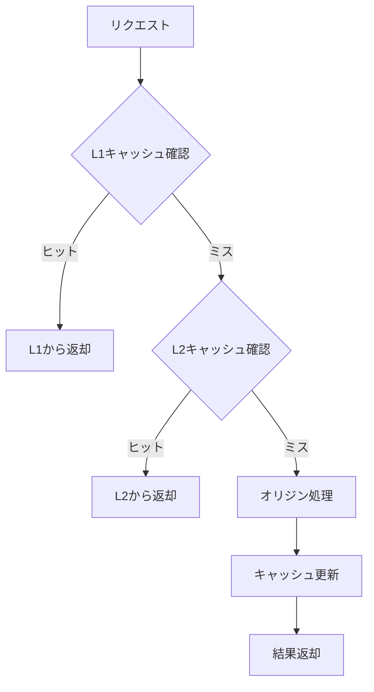

### 4-2. キャッシュ設定

#### メモリキャッシュ（L1）

- 対象：頻出パターン、設定値
- 保持時間：1時間
- 最大サイズ：256MB
- 更新方式：LRU

#### ディスクキャッシュ（L2）

- 対象：生成済みコンテンツ
- 保持時間：24時間
- 最大サイズ：1GB
- 更新方式：FIFO

### 4-3. キャッシュ無効化

#### 自動無効化

- TTL期限切れ
- 容量超過時
- デプロイ時

#### 手動無効化

- 緊急時の強制クリア
- パターン指定での部分削除
- 定期メンテナンス時

### 4-4. キャッシュ監視

#### 監視項目

- ヒット率
- 容量使用率
- 応答時間
- 無効化頻度

#### アラート条件

- ヒット率 70%以下
- 容量使用率 90%以上
- 応答時間 100ms以上
- 無効化頻度 10回/分以上

## 5. データ永続化

### 5-1. ストレージ構成

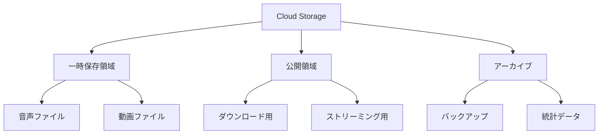

### 5-2. データ保持ポリシー

#### 一時保存データ

- 音声ファイル: 処理完了後24時間
- 中間生成物: 処理完了後即時削除
- エラーログ: 7日間

#### 永続化データ

- 生成済み動画: 24時間
- 利用統計: 90日間
- システムログ: 30日間
- 監査ログ: 1年間

### 5-3. バックアップ戦略

#### 定期バックアップ

- システム設定: 日次
- 利用統計データ: 週次
- ログデータ: 月次

#### リテンション期間

- システム設定: 30世代
- 統計データ: 12ヶ月
- ログデータ: 5年

## 6. スケーリング戦略

### 6-1. 自動スケーリング条件

#### ワーカー数の制御

- 最小インスタンス数: 2
- 最大インスタンス数: 10
- スケールアウト閾値: CPU使用率80%超過
- スケールイン閾値: CPU使用率20%未満

#### キューの監視

- キュー深さ閾値: 100タスク
- 処理待ち時間閾値: 5分
- スケール間隔: 1分

### 6-2. 負荷分散

#### リージョン設定

- プライマリ: asia-northeast1
- セカンダリ: asia-northeast2
- フェイルオーバー: 自動

#### トラフィック制御

- CDN利用: 動画配信
- ロードバランサー: リクエスト分散
- レート制限: リージョンごとに設定
