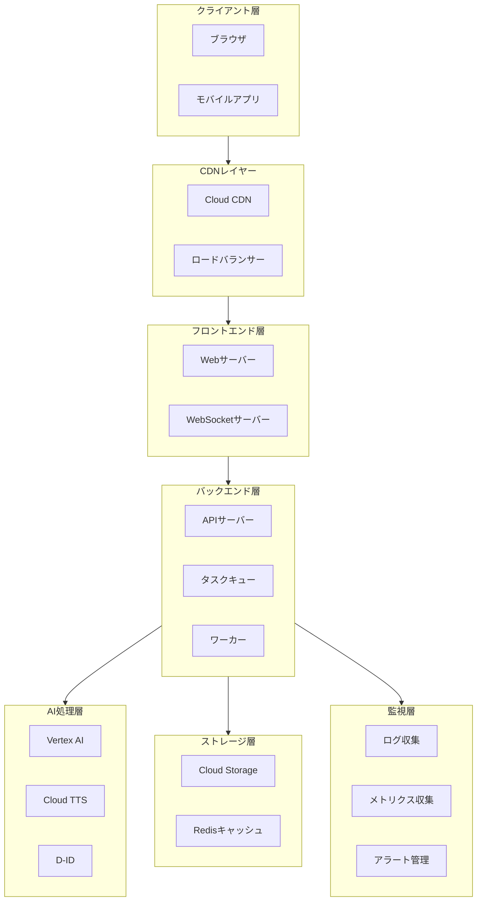
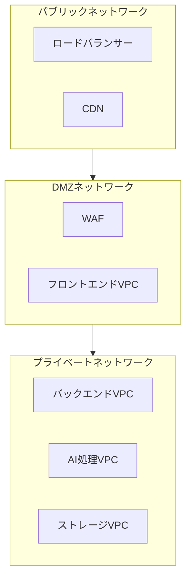

# AIコウチョウ - インフラ設計

## 1. システム構成図

### 1-1. 全体構成

### 1-2. ネットワーク構成

## 2. スケーリング設計

### 2-1. オートスケーリング設定

#### フロントエンド層

- インスタンスタイプ: n1-standard-2
- 最小インスタンス数: 2
- 最大インスタンス数: 10
- スケールアウトトリガー:
  - CPU使用率: 70%以上
  - メモリ使用率: 80%以上
  - リクエスト数: 1000/分以上
- スケールインクールダウン: 10分

#### バックエンド層

- インスタンスタイプ: n1-standard-4
- 最小インスタンス数: 3
- 最大インスタンス数: 15
- スケールアウトトリガー:
  - CPU使用率: 75%以上
  - メモリ使用率: 85%以上
  - キュー待ち数: 100以上
- スケールインクールダウン: 15分

#### ワーカー層

- インスタンスタイプ: n1-standard-8
- 最小インスタンス数: 2
- 最大インスタンス数: 10
- スケールアウトトリガー:
  - タスクキュー深さ: 50以上
  - 処理待ち時間: 5分以上
- スケールインクールダウン: 20分

### 2-2. 負荷分散設計

#### グローバル負荷分散

- マルチリージョン配置
  - プライマリ: asia-northeast1 (東京)
  - セカンダリ: asia-northeast2 (大阪)
- リージョン間負荷分散
  - レイテンシーベースルーティング
  - ヘルスチェックベースフェイルオーバー

#### リージョン内負荷分散

- ロードバランサータイプ: Application Load Balancer
- 分散アルゴリズム: ラウンドロビン
- セッション維持: 有効（30分）
- ヘルスチェック間隔: 30秒

## 3. セキュリティ設計

### 3-1. ネットワークセキュリティ

#### 境界防御

- クラウドArmor（WAF）
  - SQLインジェクション対策
  - XSS対策
  - DDoS防御
- IPアドレス制限
  - 管理画面アクセス制限
  - API制限

#### 通信暗号化

- TLS 1.3強制
- 証明書自動更新
- 通信経路暗号化
  - クライアント-サーバー間
  - サーバー間通信
  - バックエンド-外部API間

### 3-2. アクセス制御

#### ID管理

- IAM権限管理
  - 最小権限の原則
  - サービスアカウント分離
  - 定期的な権限レビュー

#### 認証・認可

- ユーザー認証
  - OAuth 2.0
  - MFA対応
- APIアクセス制御
  - APIキー管理
  - レート制限
  - IPホワイトリスト

### 3-3. データセキュリティ

#### データ暗号化

- 保存データ
  - AES-256暗号化
  - 鍵のローテーション
- 転送データ
  - TLS 1.3
  - 証明書管理

#### データ保護

- 個人情報管理
  - 暗号化保存
  - アクセスログ記録
- 一時データ
  - 自動削除
  - アクセス制限

## 4. バックアップ設計

### 4-1. バックアップ方式

#### システムバックアップ

- スケジュール
  - フルバックアップ: 週次
  - 差分バックアップ: 日次
  - トランザクションログ: 1時間毎
- 保持期間
  - フルバックアップ: 4週間
  - 差分バックアップ: 1週間
  - トランザクションログ: 24時間

#### データバックアップ

- 生成コンテンツ
  - バックアップ頻度: 日次
  - 保持期間: 7日間
- 設定データ
  - バックアップ頻度: 変更時
  - 保持期間: 30世代
- ログデータ
  - バックアップ頻度: 日次
  - 保持期間: 1年間

### 4-2. リストア手順

#### 障害時リストア

1. 障害範囲特定
2. リストアポイント決定
3. システム停止判断
4. バックアップデータ取得
5. リストア実行
6. 整合性確認
7. システム再開

#### 定期テスト

- リストアテスト: 月1回
- リカバリ訓練: 四半期毎
- 手順書更新: 半年毎

### 4-3. ディザスタリカバリ

#### リージョン障害対策

- セカンダリリージョン: asia-northeast2
- RPO (目標復旧地点): 10分
- RTO (目標復旧時間): 30分

#### フェイルオーバー手順

1. プライマリ障害検知
2. トラフィック切り替え判断
3. DNSレコード更新
4. セカンダリ起動確認
5. 監視設定切り替え
6. 正常性確認

## 5. 監視設計

### 5-1. 基本監視項目

#### システム監視

- CPU使用率（閾値: 90%以上）
- メモリ使用率（閾値: 90%以上）
- ディスク使用率（閾値: 85%以上）
- プロセス死活監視

#### 外部サービス監視

- Vertex AI: 応答確認
- Cloud TTS: 応答確認
- D-ID: 応答確認

### 5-2. エラー通知

#### 通知設定

- 通知チャネル: Slack
- 通知頻度: エラー発生時のみ
- 抑制期間: 同一エラー30分

#### 通知対象

- システムダウン
- 外部サービス接続エラー
- ディスク容量警告
- プロセス異常停止

## 6. コスト管理

### 6-1. 基本コスト管理

- 月次予算設定
- 予算超過アラート（80%到達時）
- 利用料金レポート（月次）

### 6-2. リソース制限

- インスタンス数上限設定
- ストレージ容量制限
- API利用量制限

## 7. メンテナンス計画

### 7-1. 基本メンテナンス

- セキュリティパッチ適用: 重要度に応じて適用
- バックアップ確認: 週次
- ログローテーション: 週次
- 不要データ削除: 月次

### 7-2. 障害対応

- 一次切り分け手順の整備
- 外部サービス障害時の代替手順
- 復旧手順の文書化
- 障害報告書テンプレート
