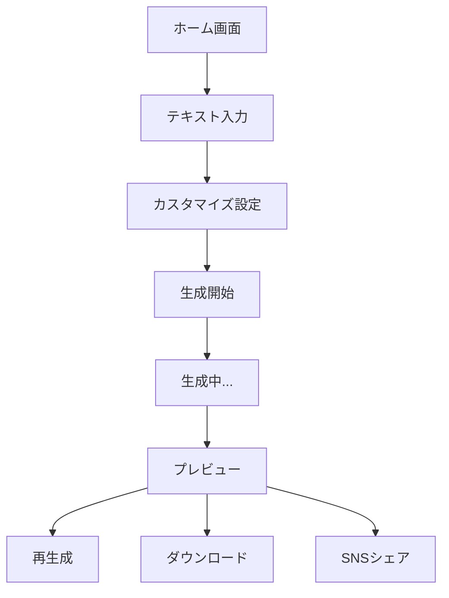

# AIコウチョウ - ユーザーガイド

## はじめに

AIコウチョウは、あなたの入力したテキストを校長先生風のスピーチに変換し、音声付きアバター動画として出力するサービスです。
エンターテインメントと教育的要素を組み合わせた、ユニークな動画生成サービスをお楽しみください。

## 基本的な使い方の流れ



### 各画面の説明

#### 1. ホーム画面

- サービスの概要説明
- 最新の人気動画サンプル
- ログイン/新規登録ボタン

#### 2. テキスト入力画面

- 入力フォーム（1000文字まで）
- テンプレート選択機能
- 文字数カウンター

#### 3. カスタマイズ設定画面

- 校長先生の声質選択
- 学年別モード設定
- BGM/効果音の選択
- 背景設定

#### 4. 生成中画面

- 進捗状況バー
- 各ステップの状態表示
  1. テキスト変換中
  2. 音声生成中
  3. アバター生成中
  4. 動画作成中

#### 5. プレビュー画面

- 動画プレビュー
- 編集・再生成ボタン
- ダウンロード/シェアボタン

## 入力のガイドライン

### 推奨される入力形式

- 一つの話題につき200-300文字程度
- 起承転結を意識した文章構成
- 具体的なエピソードや例を含める

### 避けるべき入力

- 個人情報や機密情報
- 過度に専門的な用語
- 複数の無関係な話題
- 不適切な表現や差別的な内容

### テンプレート例

1. 学校行事スピーチ

```
今日の[行事名]について、生徒の皆さんに伝えたいことがあります。
[具体的なエピソード]
このように、[教訓や学び]が大切だと考えています。
```

2. お祝いメッセージ

```
[名前]さんの[お祝い事]について、一言お話しさせていただきます。
[エピソードや思い出]
これからの[期待や願い]を心からお祈りしております。
```

## 入力サポート機能

### AIアシスタントの活用

- 「アイデアを膨らませる」機能
  - キーワードや簡単な文章から、スピーチの素案を自動生成
  - 複数のバリエーションから選択可能

- 「テーマ別アシスト」機能
  - 学校行事、お祝い事、激励など、目的に応じたテンプレートを提供
  - AIがテンプレートの空欄を状況に合わせて補完

### 使用例

1. キーワードからの展開

```
入力：「文化祭 頑張った 達成感」
↓
AI展開案：
・文化祭での生徒たちの奮闘と成長
・協力することの大切さ
・達成感が人を成長させる
```

2. 簡単な文からの展開

```
入力：「部活の練習がつらい」
↓
AI展開案：
・努力と継続の大切さ
・仲間との絆
・乗り越えた先にある喜び
```

### 編集・調整機能

- 生成された文章の一部を選択して再生成
- 文章の長さや口調の調整
- 特定のキーワードや表現の追加リクエスト

## 生成結果の活用方法

### 動画編集のヒント

- 字幕の追加で理解しやすく
- BGMの音量調整で雰囲気作り
- サムネイル画像の工夫

### 効果的な共有方法

- 動画の長さに応じたプラットフォーム選択
  - 30秒以内：TikTok, Instagram Reels
  - 1-3分：YouTube Shorts
  - 3-5分：通常のYouTube投稿
- ハッシュタグの活用
  - #AIコウチョウ（必須）
  - #校長先生の一言
  - #感動スピーチ
  
### 活用事例集

1. 教育現場での活用
   - 朝礼や終礼での使用
   - 学級通信への組み込み
   - 生徒会活動での活用

2. イベントでの活用
   - 結婚式やパーティーの演出
   - 送別会のサプライズ
   - オンラインイベントの盛り上げ

3. SNSコンテンツとしての活用
   - シリーズ化による定期投稿
   - 視聴者参加型企画
   - トレンドとの組み合わせ

## 使い方

### 1. テキスト入力

- メイン画面のテキストフォームに、変換したい文章を入力します（最大1000文字）
- どんな内容でもOK！くだけた文章も校長先生風の格調高いスピーチに変換されます

### 2. 動画生成

- 「生成開始」ボタンをクリックすると、動画生成が始まります
- 生成には約60秒程度かかります
- 進捗状況はリアルタイムで表示されます

### 3. 動画の視聴・ダウンロード

- 生成完了後、プレビュー画面で動画を確認できます
- ダウンロードボタンから動画をダウンロード可能
- SNSシェアボタンで各種SNSに直接シェアすることもできます

## 利用制限

- 1日あたりの生成回数：10回まで
- 同時生成数：3件まで
- 保存容量：1ユーザーあたり1GB
- 生成された動画の保持期間：24時間
- 動画の最大長：5分

## 活用シーン

1. **イベントでの余興**
   - 結婚式やパーティーでのサプライズ演出
   - 学校行事での演出

2. **SNSコンテンツ作成**
   - 面白系動画の投稿
   - エンターテインメントコンテンツの作成

3. **教育現場での活用**
   - 学習意欲を高める教材作成
   - 生徒への励ましメッセージ

## 注意事項

- 不適切な表現や公序良俗に反する内容は自動的にフィルタリングされます
- 生成された動画の著作権や利用規約については、別途定める規約をご確認ください
- サービスの性質上、完全に同じ動画は生成されません
- システムメンテナンス時は一時的にサービスを停止する場合があります

## トラブルシューティング

**Q: 動画が生成されない**
A: 以下をご確認ください：

- テキストの文字数制限（1000文字以内）
- 1日の生成制限回数（10回）
- 同時生成数制限（3件）

**Q: 動画の品質が期待と異なる**
A: 以下の調整をお試しください：

- より短いテキストでの生成
- 文章の区切りを明確にする
- 専門用語や固有名詞の使用を控える

**Q: ダウンロードができない**
A: 以下をご確認ください：

- 24時間の保持期限が過ぎていないか
- ストレージ容量（1GB）を超えていないか

## サポート

問題が解決しない場合は、お問い合わせフォームよりご連絡ください。
サポートチームが迅速に対応いたします。

## カスタマイズオプション

### 校長先生の設定

- 声質選択：落ち着いた男性声/女性声から選択可能
- 学年別モード：小学校/中学校/高校向けの話し方に調整
- 表情設定：自然な会話表現からより感情的な表現まで

### スピーチのアレンジ

- BGM/効果音の追加
- 字幕表示のON/OFF
- 背景画像の選択

## 生成のコツ

### テキスト変換の仕組み

AIコウチョウは、あなたの入力を3段階で校長先生らしいスピーチへと変換します：

1. **メッセージの本質を引き出す**
   - 入力された内容から教育的な要素を見出します
   - 例：「スマホゲームにハマってる」
   → 「デジタル機器との付き合い方と自己管理について」

2. **校長先生らしい表現に変換**
   - 格調高い言葉遣いと説得力のある表現を追加
   - 例：「生徒諸君、現代社会における時間の使い方について、皆さんと共に考えてみたいと思います」

3. **スピーチとして整える**
   - 起承転結のある構成に整理
   - 教訓やメッセージ性を強化
   - 聞き手への呼びかけを追加

### カスタマイズ可能な要素

- 教育的要素の強さ (1-5)
  - 1: ゆるめの語り口
  - 5: 非常に教育的な内容

- 文体の格調レベル (1-5)
  - 1: カジュアルな校長先生
  - 5: 厳格な校長先生

- スピーチの長さ
  - 短: 30秒程度
  - 中: 1-2分程度
  - 長: 3-5分程度

### より良い結果を得るために

- 1つのトピックに絞って入力する
- 文章の区切りを明確にする
- 具体的なシチュエーションを設定する（例：入学式、卒業式、学園祭など）

### おすすめの使用例

- 「今日の給食がおいしかった」→ 食育についての熱いスピーチに
- 「スマホゲームにハマってる」→ 時間管理の大切さを説く演説に
- 「友達と喧嘩した」→ 友情と成長についての感動的なメッセージに

## プライバシーとセキュリティ

- 生成された動画は24時間後に自動的に削除されます
- 個人情報や機密情報は入力しないでください
- 不適切なコンテンツは自動的にフィルタリングされます
- 著作権や商標に関する配慮が必要です

## 動画の共有とコミュニティ

- SNSでの共有時は #AIコウチョウ のハッシュタグを付けることを推奨
- 人気の動画は「今週の校長先生スピーチ」としてピックアップされる可能性があります
- コミュニティガイドラインに沿った利用をお願いします

---

AIコウチョウをご利用いただき、ありがとうございます。
より良いサービスを提供できるよう、日々改善を重ねてまいります。
