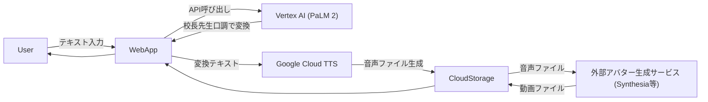

# プロジェクト名: **AIコウチョウ - ユーザー投稿から校長先生スピーチを自動生成するサービス**

## 1. 企画概要

ユーザーが自由に入力したテキストを、生成AIが「校長先生が話すような形式」に変換し、音声＋アバター動画として出力するサービスです。  
例えばユーザーが「今日はお腹がすいたから昼寝したい…」と入力しても、最終的には**校長先生がそれを学校行事風にアレンジして熱く語る**スピーチに変換されます。

### サービスのポイント

- **漸進的なテキスト変換**  
  ユーザーの文章が、段階を踏みながら「校長先生らしさ」を帯びていく演出を実現します。  
- **生成AIによる台本作成**  
  テーマ（例：新学期、卒業式、学園祭など）を AI が自動で補強し、面白い校長先生スピーチを作成。  
- **アバター合成＆音声出力**  
  Google Cloud Text-to-Speech などを用いて合成音声を生成し、外部アバター生成サービスと連携して動画を完成。  

---

## 2. コンセプト

1. **誰でも校長先生になれる**  
   入力された内容が、あくまで「校長先生口調」に変換されてしまう不思議＆面白さ。  
2. **エンタメ×教育の両立**  
   教育現場の雰囲気を醸しつつ、一般の人が見ても笑える仕掛けを盛り込む。  
3. **AIの敷居を下げる**  
   ワンクリック～数ステップでユーモラスな映像を作り、SNSで簡単共有可能。  

---

## 3. 機能一覧

1. **ユーザー投稿フォーム**
   - テキスト（自由入力）や「校長先生になってほしいテーマ」を入力。
   - 例: 「最近YouTubeにハマってしまって勉強できないよ～」など。

2. **テキスト変換フロー**
   1. **Phase 1:** ユーザーの生のテキストを受け取り、生成AIで“校長先生っぽい口調”に書き換える。  
   2. **Phase 2:** 校長先生的キーワード（例: 「生徒諸君」「未来を担う君たち」など）を盛り込み、内容をブラッシュアップ。  
   3. **Phase 3:** 最終調整として、表現をやや誇張したり、教育的指導要素を追加して仕上げる。

3. **音声合成（TTS）**  
   - Google Cloud Text-to-Speech を使用し、中年男性～落ち着いた女性声などから選択可。  
   - SSML でイントネーションや一時停止を調整し、臨場感を演出。

4. **アバター生成（外部サービス連携）**  
   - Synthesia / D-ID / HeyGen 等のAPIに音声ファイルとスピーチテキストを渡し、  
   - 校長先生キャラが口パクで話す動画を生成。  
   - 生成後の動画ファイルをサービス側でホスティング or ダウンロード提供。

5. **プレビュー＆共有**  
   - 完成した動画をプレビューで確認。  
   - SNS共有用のリンク生成、またはファイルをダウンロードして活用可能。

---

## 4. 想定アーキテクチャ

 1. WebApp: ユーザーからの入力を受け取り、API連携を司る。
 2. Vertex AI: 文章生成部分（校長先生口調への変換）担当。
 3. Google Cloud TTS: 合成音声ファイルを生成。
 4. 外部アバター生成サービス: 声に合わせた口パク映像を生成。
 5. Cloud Storage: 生成ファイル（音声・動画）を一時保存し、WebApp から配信。

---

## 5. ユースケース

 1. エンタメ投稿として
 • 「変な校長先生スピーチ動画を友達に送る」
 • 「結婚式の余興で、校長先生が新郎新婦を祝福するメッセージにする」など。
 2. 学校でのちょっとした教材利用
 • 児童・生徒からのフレーズを校長先生がまとめてくれる風に作り、教育現場で活用。
 3. SNSネタ
 • TikTok、YouTube Shorts で「AI校長シリーズ」として投稿・拡散狙い。

---

## 6. 開発スケジュール (例)

工程 期間 内容
A. プロトタイプ設計 1週間 - データフロー & アーキテクチャ設計- 画面モックアップ作成
B. AI連携実装 2週間 - Vertex AI で文章生成- Cloud TTS の音声合成- 外部アバター生成API接続
C. フロントエンド実装 1〜2週間 - ユーザー入力フォーム- プレビュー画面- SNSシェア機能など
D. テスト & 改善 1〜2週間 - バグ修正- 校長先生風口調のチューニング- 動画生成の安定化
E. β版リリース & フィードバック 随時 - ユーザー試用- フィードバック収集- 場合によって有料プラン検討

---

### 7. 将来的な展望

 • 複数キャラ・複数言語対応
 • 副校長先生、担任の先生、生徒会長など、キャラクター拡張。
 • 多言語対応して「世界の校長先生」がスピーチする動画も可能に。
 • 高度な編集機能
 • テロップや背景切り替え、BGM等を自動挿入。
 • ユーザーコミュニティ活性化
 • 人気の「AI校長スピーチ」をランキング化、共有＆二次創作OKの土壌作り。

---

### 8. まとめ

AIコウチョウは、ユーザーが何を入力しても最終的には「校長先生が話すスピーチ」へと導く面白さが魅力です。
Google Cloud の生成AIや音声合成技術、外部アバター生成サービスとの連携によって、
“誰でも気軽に、校長先生のありがた～い（？）お話動画を作る” という新しいエンタメ体験を提供します。
